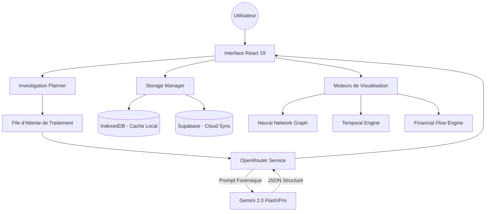

# 🏗️ Architecture Logicielle - DOJ Forensic

Ce document détaille l'organisation technique, les flux de données et les choix de conception de l'application **DOJ Forensic**.

---

## 🧭 Vue d'Ensemble

L'application adopte une architecture **Single Page Application (SPA)** moderne, centrée sur le concept de **"Local-First"**. L'objectif est de garantir une réactivité instantanée pour l'utilisateur tout en permettant une analyse asynchrone lourde via des modèles de langage (LLM).

### Schéma des Flux de Données (Mermaid)

---

## 🧱 Couches Techniques

### 1. Couche de Présentation (React 19)
- **Framework** : React 19 utilisant les Hooks avancés (`useOptimistic`, `useTransition`) pour une gestion fluide des états de chargement.
- **Design System** : Utilisation massive de **Tailwind CSS 4** avec des composants personnalisés pour simuler une interface de laboratoire technologique (verre optique, flous gaussiens, typographie sérigraphiée).
- **Navigation** : Système de vues dynamiques (`lab`, `database`, `network`, `timeline`, `finance`, etc.) piloté par l'état global.

### 2. Moteur d'Intelligence (Analytical Core)
- **Orchestration** : Localisée dans `services/openRouterService.ts`.
- **Analyse** : Les documents sont découpés et envoyés avec des instructions système extrêmement précises (`SYSTEM_INSTRUCTION_DISCLOSURE`) pour forcer une sortie JSON valide.
- **Traitement Asynchrone** : Gestion d'une file d'attente (Queue) permettant de traiter plusieurs documents à la suite sans bloquer l'interface.

### 3. Persistance & Synchronisation (Storage Strategy)
L'application utilise une approche hybride :
- **IndexedDB (Local)** : Via la bibliothèque `idb`. C'est le dépôt principal de l'application. Chaque résultat d'analyse est persisté localement en moins de 10ms.
- **Supabase (Remote)** : Sert de couche de synchronisation multi-dispositifs. Les données sont "upsertées" vers Supabase dès qu'elles sont validées localement, permettant de retrouver ses investigations sur n'importe quel terminal.

### 4. Modules de Visualisation Forensique
- **Cartographie de Réseau** : Implémentée avec `react-force-graph-2d`. Elle transforme la liste des entités extraites en un graphe de relations dynamique.
- **Moteur Temporel** : Un composant chronologique qui trie et affiche les documents et faits clés sur une échelle de temps, facilitant la détection d'anomalies.
- **Extraction Financière** : Algorithme dédié à la détection de montants, devises et flèches de flux (source -> destination) au sein des textes bruts.

---

## 🔒 Sécurité & Intégrité

- **Clés API** : Les clés (OpenRouter/Supabase) sont gérées via des variables d'environnement Vite ou via l'interface de paramètres (sauvegardées en LocalStorage crypté par le navigateur).
- **Isolation des Sessions** : Chaque investigation possède un ID unique (`CASE-XXXX`) garantissant l'absence de collision de données.
- **Validation JSON** : Un système d'assainissement (`sanitizeJsonBlock`) nettoie les réponses de l'IA pour extraire uniquement le code JSON, évitant les erreurs de parsing liées aux commentaires ou au texte explicatif du LLM.

---

## 🚀 Performance

- **Lazy Loading** : Les vues lourdes (Graphes) sont chargées uniquement lorsqu'elles sont actives.
- **Optimistic UI** : L'interface affiche immédiatement les changements (ex: ajout d'une analyse) avant même que le serveur n'ait confirmé la sauvegarde, offrant une sensation de vitesse instantanée.
