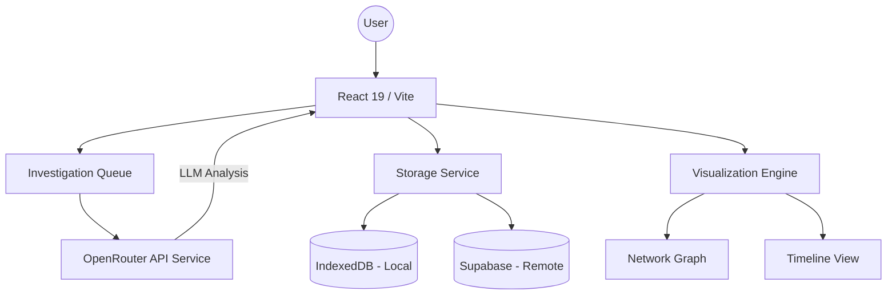

# 🏗️ System Architecture

The **Analyseur de Documents Judiciaires** (DOJ Forensic) is built on a modern, local-first architecture designed for speed, resilience, and complex data visualization.

## 🧱 Architectural Overview

The application is a Single Page Application (SPA) that orchestrates distributed services without a dedicated middleware backend.

---

## 🏗️ Technical Layers

### 1. Presentation Layer (React 19)
- **High-Performance Rendering**: Uses React's concurrent rendering for fluid UI even during heavy data processing.
- **Micro-Animations**: Framer Motion and custom CSS transitions for a premium "investigative lab" feel.
- **State Management**: Local component state for UI toggles, and a lifted state in `App.tsx` for core analytical data.

### 2. Analytical Intelligence (OpenRouter & Gemini)
- **Engine**: Google Gemini 2.5 Flash Lite via OpenRouter.
- **Prompt Engineering**: Specialized system instructions (`SYSTEM_INSTRUCTION_DISCLOSURE`) that force the AI to act as a forensic investigator and output structured JSON.
- **Extraction Logic**: Automated cleaning of markdown blocks and recursive retries for API reliability.

### 3. Data Visualization (Forensic Views)
- **Network Graph**: Uses `react-force-graph-2d` to visualize relationships between entities (People, Organizations, Locations).
- **Temporal Analysis**: A custom Timeline view to map events chronologically.
- **Investigation Planner**: A proactive UI that helps users structure their search queries for better AI extraction.

### 4. Storage & Persistence (Local-First Design)
- **Resilience**: Even without an internet connection, previously analyzed data is available via IndexedDB.
- **Sync Strategy**: 
  - **Local**: `idb` library for high-speed local document indexing.
  - **Remote**: Supabase provides cross-device persistence and team-focused data sharing.
- **Encryption**: Data transit is encrypted via HTTPS; database storage follows Supabase security standards.

---

## 🔒 Security Architecture
- **API Key Proxying**: Recommended to use serverless functions for production, but currently handled via Vite env variables for developer flexibility.
- **Isolation**: Each analysis session is isolated by a unique ID.
- **Data Privacy**: No data is harvested for training; interactions are strictly between the Client and the authorized AI/DB providers.
